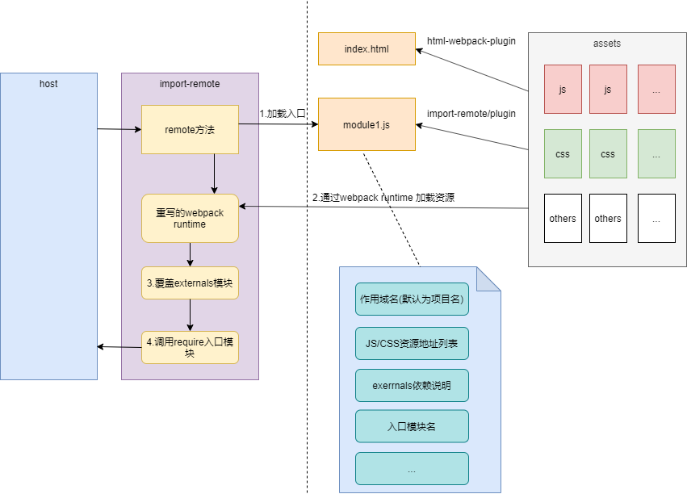

# import-remote

[](https://npmjs.com/package/import-remote)
[](https://npmjs.com/package/import-remote)

## 说明

一个远程加载JS模块的库。支持webpack4/5。

它的初衷是：

  - 希望像`html-webpack-plugin`插件生成HTML入口文件那样生成一个JS入口文件；

  - 插件的配置参数基本和`html-webpack-plugin`保持一致，以便只需将`html-webpack-plugin`插件替换为`import-remote/plugin`插件即可在`html`和`JS`入口间切换；

  - 解决JS模块依赖传递的问题：不再是通过`window`变量来传递依赖；

  - 支持自动从公共包中加载依赖；

  - 利于`webpack`的懒加载功能实现公共包中的导出组件按需加载；

  - 提供`global.xxx`、`window.xxx`这些全局变量私有化作用域的功能，避免污染`window`；

  - 为`JS/CSS`动态添加`publicPath`，方便一份打包成果多处部署；

  - `JS/CSS`资源异步获取，避免通过`script`、`link`加载资源导致的同步加载；

  - 支持多入口文件，实现多模块代码/作用域共享;

### 和`html-webpack-plugin`的区别

  - `html-webpack-plugin`生成的是HTML入口；`import-remote/plugin`生成的JS入口；

  - HTML入口通过浏览器或`iframe`标签加载；JS入口通过`import-remote`提供的加载方法(`remote`)加载；

### 和`webpack library`打包的区别

  - `webpack library`的入口JS可以直接通过`script`标签加载，支持资源跨域；`import-remote`的入口JS需要专门提供的加载方法(`remote`)加载，该方法通过`ajax`请求加载资源，所以资源间的跨域问题需要使用者自行解决；

  - `webpack library`的模块依赖需要通过从`window`变量获取；`import-remote`的模块依赖只需在加载方法(`remote`)中传递进去即可；

  - `webpack library`包必须配置`publicPath`；`import-remote`无需配置`publicPath`或只需配置为`/`，加载方法(`remote`)在加载资源时会自动配置JS的`publicPath，并且查找CSS源代码中的相对路径，将其替换为绝对路径；

### 实现原理

#### 构建期

参考`html-webpack-plugin`生成的js入口里，实际上是该入口依赖的mainfest信息，包含入口JS/CSS文件、external等信息；

#### 加载期
  
`import-remote`的加载方法调用时：
  1. 加载入口JS文件；
  2. 根据入口JS里的信息，通过ajax请求下载入口JS/CSS资源;
  3. 通过内置的重写`webpack运行时`加载相关资源;
  4. 根据`external`信息，替换调加载模块中的这些外部模块；
  5. 调用入口模块，获取它的`modlule.exports`;
  6. 返回获取到的`modlule.exports`；



## 安装

```bash
  npm install --save import-remote
```

或者：

```bash
  yarn add import-remote
```

## 插件使用说明

通过`import-remote/plugin`插件可以为你的`webpack`包生成一个JS入口文件。下面是一个`webpack`配置示例:

**webpack.config.js**

```js
const ImportRemotePlugin = require('import-remote/plugin')

const entryFiles = ['index', 'foo', 'bar'];

module.exports = {
  // 配置入口，可以配置多个入口
  entry: {
    ...(entryFiles.reduce((p, file) => {
      p[file] = `${file}.js`;
      return p;
    }, {}))
  }
  // 配置输出目录
  output: {
    path: __dirname + '/dist',
    filename: 'assets/[name]-[chunkhash:5].js',
    chunkFilename: 'assets/[name]-[chunkhash:5]-chunk.js',
  },
  // 配置外部依赖
  externals: [
    'react',
    'react-dom',
    'lodash'
  ],
  plugins: [
    // 装载插件
    ...entryFiles.map(file => new ImportRemotePlugin({
      template: `auto`,
      // 生成的入口文件名
      filename: `${file}.js`,
      // 包含的入口chunk
      chunks: [file],
    }))
    
  ]
}
```

入口文件示例：

**src/index.js**

```js
import React from 'react';
import ReactDOM from 'react-dom';
import _ from 'lodash',

const test = {
  dosomething() {
    console.log('dosomething', React, ReactDOM, _);
  }
}

// 导出你要导出的内容
module.exports = test;
```

**宿主端使用示例**

```js
import remote from 'import-remote';

async function run() {
  // 通过await等待模块加载完毕
  const testIndex = await remote('http://localhost:3000/test/index.js', {
    // 配置模块需要依赖
    externals: { 
      react: require('react'), 
      'react-dom': require('react-dom'),
      'lodash': require('lodash'),
    }
  });
  // 拿到模块输出对象后，即可做你想做的任何事了
  testIndex.dosomething();

  // 也可以将依赖配置成全局依赖，这样importRemote时就不必再传依赖了
  Object.assign(remote.externals, { 
    react: require('react'), 
    'react-dom': require('react-dom'),
    'lodash': require('lodash'),
  });
  const testOther = await remote('http://localhost:3000/test/other.js');
  testOther.dosomething();
}

run();
```

`import-remote`还提供了远程模块(`RemoteModule`)类，方便管理同一组模块：

```js
import { RemoteModule } from 'import-remote';

// 配置RemoteModule的host和依赖
const testModule = new RemoteModule('http://localhost:3000/test', {
  externals: { 
    react: require('react'), 
    'react-dom': require('react-dom'),
    'lodash': require('lodash'),
  }
});

// 具体的加载路径为RemoteModule的`${host}${requireName}.js`
const testIndex = await testModule.require('index');
const testOther = await testModule.require('other');

testIndex.dosomething();
testOther.dosomething();

```

### `import-remote/plugin`插件基本配置选项

`import-remote/plugin`的基本配置选项基本和`html-webpack-plugin`一致，这样目的是方便两个插件间切换。

|属性名|类型|默认值|说明|
|:--:|:--:|:-----:|:----------|
|**`filename`**|`{String}`|`'index.js'`|生成的入口文件名。默认为`index.js`. 你也可以在这里指的子目录 (比如: `entrys/index.js`)|
|**`hash`**|`{Boolean}`|`false`|如果值为true，就添加一个唯一的webpack compilation hash给所有JS和CSS文件。这对缓存清除（cache busting）十分有用|
|**`cache`**|`{Boolean}`|`true`|如果为true (默认)，只要文件被更改了就生成文件|
|**`showErrors`**|`{Boolean}`|`true`|如果为true (默认)，详细的错误信息将被写入到JS文件中|
|**`chunks`**|`{?}`|`?`|允许你只添加某些chunks(e.g only the unit-test chunk)|
|**[`chunksSortMode`](#plugins)**|`{String\|Function}`|`auto`|在chunks被include到html文件中以前，允许你控制chunks 应当如何被排序。允许的值: `none`|`auto`|`dependency`|{Function} - 默认值: `auto`|
|**`excludeChunks`**|`{Array.<string>}`|``|允许你跳过某些chunks (e.g don't add the unit-test chunk)|


#### 生成多输出入口文件

要生成多个输出入口文件，只需要在你的插件列表中配置多个`ImportRemotePlugin`插件：

```js
{
  entry: 'index.js',
  output: {
    path: __dirname + '/dist',
    filename: 'index_bundle.js'
  },
  plugins: [
    new ImportRemotePlugin(), // 生成默认的index.js
    new ImportRemotePlugin({  // 同时生成一个test.js
      filename: 'test.js',
    })
  ]
}
```

#### 过滤Chunks

要只打包特定的chunk包，你可以通过`chunks`属性来控制：

```js
plugins: [
  new ImportRemotePlugin({
    chunks: ['app']
  })
]
```

你也可以配置要排除特定的包，通过`excludeChunks`选项来控制：

```js
plugins: [
  new ImportRemotePlugin({
    excludeChunks: [ 'dev-helper' ]
  })
]
```

#### 长期缓存

要支持长期缓存，你可以通过为`filename`添加`contenthash/templatehash`：

```js
plugins: [
  new ImportRemotePlugin({
    filename: 'index.[contenthash].js'
  })
]
```

`contenthash/templatehash` 是输出文件内容的hash。

另外, 你也可以这样配置hash： `[<hashType>:contenthash:<digestType>:<length>]`

* `hashType` - `sha1`、`md5`、`sha256`、`sha512`之一，或者任意一种node.js支持的hash类型
* `digestType` - `hex`、`base26`、`base32`、`base36`、`base49`、`base52`、`base58`、 `base62`、`base64`之一
* `maxlength` - 生成的hash字符的最大程度

**默认为:** `[md5:contenthash:hex:9999]`


### `import-remote/plugin`插件额外配置选项

除了从`html-webpack-plugin`继承的配置选项，`import-remote/plugin`也提供了一些自己的配置选项：

|属性名|类型|默认值|说明|
|:--:|:--:|:-----:|:----------|
|**`commonModules`**|`[{ name: string, url: string, scoped?: boolean }]`|`[]`|依赖的公共模块，如果配置了公共模块，则模块的依赖将尝试从这些公共模块中加载依赖。该功能依赖于webpack的externals|
|**`shareModules`**|`[string or { name: string, var: string }]`|`[]`|共享模块列表，如果配置了共享模块，则模块的这些依赖将优先使用宿主应用externals参数中传递的依赖，如果未在宿主应用中找到，才使用自己的该模块。该功能不依赖webpack的externals。
|**`globalToScopes`**|`string[]`|`[]`|需要局部化的全局变量，该数组中声明的名称，在加载资源时将会从源代码中将其替换为从某个私有变量中读取这些值|


#### 公共模块包

提供公共模块包的目的是方便公共模块的共享，同时利用`webpack`的懒加载功能实现组件的按需加载。

这是一个公共模块包的示例：

**index.js**
```js
import { createRequireFactory } from 'import-remote';

export default createRequireFactory({
  react: () => import(/* webpackChunkName: 'react' */ 'react'),
  'react-dom': () => import(/* webpackChunkName: 'react-dom' */ 'react-dom'),
  'prop-types': () => import(/* webpackChunkName: 'prop-types' */ 'prop-types'),
  axios: () => import(/* webpackChunkName: 'axios' */ 'axios'),
  axios: () => import(/* webpackChunkName: 'axios' */ 'axios'),
  mobx: () => import(/* webpackChunkName: 'mobx' */ 'mobx'),
  'mobx-react': () => import(/* webpackChunkName: 'mobx-react' */ 'mobx-react'),
  moment: () => import(/* webpackChunkName: 'moment' */ 'moment'),
  qs: () => import(/* webpackChunkName: 'qs' */ 'qs'),
});

```

**webpack.config.js**

```js
const ImportRemotePlugin = require('import-remote/plugin')

module.exports = {
  entry: {
    index: 'index.js'
  }
  output: {
    filename: '[name]-[chunkhash:5].js'
  },
  plugins: [
    new ImportRemotePlugin()
  ]
}
```

一个依赖公共包的webpack配置如下：

**webpack.config.js**

```js
const ImportRemotePlugin = require('import-remote/plugin')

module.exports = {
  entry: {
    index: 'index.js'
  }
  output: {
    filename: '[name]-[chunkhash:5].js'
  },
  externals: {
    react: {
      root: 'React',
      amd: 'react',
      commonjs2: 'react',
      commonjs: 'react',
    },
    'react-dom': {
      root: 'ReactDOM',
      amd: 'react-dom',
      commonjs2: 'react-dom',
      commonjs: 'react-dom',
    },
    mobx: {
      root: 'mobx',
      commonjs: 'mobx',
      commonjs2: 'mobx',
    },
    'mobx-react': {
      root: 'mobxReact',
      commonjs: 'mobx-react',
      commonjs2: 'mobx-react',
    },
  },
  plugins: [
    new ImportRemotePlugin({
      commonModules: [
        { name: 'a-common-modules', url: 'http://localhost:3000/common/index.js' }
      ]
    })
  ]
}
```

则这个模块的依赖：

  1. 首先从宿主使用加载方法`remote`中配置的`externals`中寻找依赖；

  2. 第一步没找到依赖，将会从模块中寻找依赖；

#### 共享模块

通过共享模块，使多个远程应用间使用共同的依赖。

这是一个共享模块包的配置示例：

**webpack.config.js**

```js
const ImportRemotePlugin = require('import-remote/plugin')

module.exports = {
  entry: {
    index: 'index.js'
  }
  output: {
    filename: '[name]-[chunkhash:5].js'
  },
  plugins: [
    new ImportRemotePlugin({
      shareModules: [
        { name: 'react', var: 'react' },
        { name: 'react-dom', var: 'ReactDOM' }
      ]
    })
  ]
}
```

宿主传递共享模块的方式：

```js
import remote from 'import-remote';

// 通过await等待模块加载完毕
const testIndex = await remote('http://localhost:3000/test/index.js', {
  // 共享模块也可以通过externals来传递
  externals: { 
    react: require('react'), 
    'react-dom': require('react-dom'),
  }
});
```

#### 全局变量私有化

通过`globalToScopes`选项可以将你的源代码中一些`window.xxx`、`global.xxx`的变量替换为一个同组模块共享的私有变量中。这在相互集成时全局变量冲突时的一种解决办法；

如果你的webpack配置是这样的：

```js
const ImportRemotePlugin = require('import-remote/plugin')

module.exports = {
  entry: {
    index: 'index.js'
  }
  output: {
    filename: '[name]-[chunkhash:5].js'
  },
  plugins: [
    new ImportRemotePlugin({
      globalToScopes: ['app', 'someVar']
    })
  ]
}
```

则宿主在加载你的模块时，将会把你源代码中的`global.app`、`window.app`、`global.someVar`、`window.someVar`替换成`__windowProxy__.globals.app`、`__windowProxy__.globals.someVar`。

注：全局变量私有化可能有风险，需要您仔细斟酌是否使用。毕竟最好的方案就是没有全局变量。该选项只是用于解决您目前无法或没时间去掉全局变量时的一种托底解决办法。

## 运行期包使用说明

### 远程加载方法

函数签名：

```ts
/**
 * @param {string} url 远程模块的url地址
 * @param {object} options 加载选项
 * @param {object} options.externals 远程模块的依赖模块
 * @param {boolean} options.useEsModuleDefault 当远程模块导出的是ES模块时，是否只返回它的default导出部分
 * @returns {Promise<any>} 远程模块的导出内容
 **/
function remote(url: string, options: { externals: { [key]: any } }): Promise<any>; 
```

使用方法：

```js
import remote from 'import-remote';

// 通过await等待模块加载完毕
const testIndex = await remote('http://localhost:3000/test/index.js', {
  // 配置模块需要依赖
  externals: { 
    react: require('react'), 
    'react-dom': require('react-dom'),
    'lodash': require('lodash'),
  }
});
// 拿到模块输出对象后，即可做你想做的任何事了
testIndex.dosomething();
```

### 远程模块

通过远程模块可以用于管理一个项目生成的所有模块：

```js
import { RemoteModule } from 'import-remote';

// 配置RemoteModule的host和依赖
const testModule = new RemoteModule('http://localhost:3000/test', {
  externals: { 
    react: require('react'), 
    'react-dom': require('react-dom'),
    'lodash': require('lodash'),
  }
});

// 具体的加载路径为RemoteModule的`${host}${requireName}.js`
const testIndex = await testModule.require('index');
const testOther = await testModule.require('other');

testIndex.dosomething();
testOther.dosomething();
```

`RemoteModule`的的方法有：
```ts
{
  /**
   * @param {string} host 该项目生成的模块的基地址(host)
   * @param {object} options 加载选项
   * @param {object} options.externals 远程模块的依赖模块
   * @param {boolean} options.useEsModuleDefault 当远程模块导出的是ES模块时，是否只返回它的default导出部分
   * @returns {void}
   **/
  constructor(host: string, options: { externals: { [key]: any } }): void; 
  
  /**
   * 根据模块名生成该模块的入口地址
   * @param {string} moduleName 模块名，调用
   * @returns {string} 该模块的入口地址
   **/
  resolveModuleUrl(moduleName: string = 'index'): string; 

  /**
   * 发送HEAD请求判断`moduleName`是否存在，当存在时返回请求的响应头信息
   * @param {string} moduleName 模块名，调用
   * @param {object} options 加载选项
   * @returns {Promise<object|null>} HEAD请求头信息或为空
   **/
  exist(moduleName: string = 'index', options: {}): Promise<any>; 

  /**
   * 获取`moduleName`的meta信息
   * @param {string} moduleName 模块名，调用
   * @param {object} options 加载选项，和remote方法的option一致
   * @returns {Promise<any>} 模块的meta信息
   **/
  requireMeta(moduleName: string = 'index', options: {}): Promise<any>; 

  /**
   * 功能和requireMeta相同，只是将加载资源时的ajax设置为同步请求
   * @param {string} moduleName 模块名，调用
   * @param {object} options 加载选项，和remote方法的option一致
   * @returns {any} 远程模块的导出内容
   **/
  requireMetaSync(moduleName: string = 'index', options: {}): any; 

  /**
   * 异步加载方法
   * @param {string} moduleName 模块名，调用
   * @param {object} options 加载选项，和remote方法的option一致
   * @returns {Promise<any>} 远程模块的导出内容
   **/
  require(moduleName: string = 'index', options: {}): Promise<any>; 

  /**
   * 功能和require相同，只是将加载资源时的ajax设置为同步请求
   * @param {string} moduleName 模块名，调用
   * @param {object} options 加载选项，和remote方法的option一致
   * @returns {any} 远程模块的导出内容
   **/
  requireSync(moduleName: string = 'index', options: {}): any; 

  /**
   * 异步加载方法,功能和require相同，只是在导出模块为es模块时，只导出它的default部分
   * @param {string} moduleName 模块名，调用
   * @param {object} options 加载选项，和remote方法的option一致
   * @returns {Promise<any>} 远程模块的导出内容
   **/
  import(moduleName: string = 'index', options: {}): Promise<any>; 

  /**
   * 功能和import相同，只是将加载资源时的ajax设置为同步请求
   * @param {string} moduleName 模块名，调用
   * @param {object} options 加载选项，和remote方法的option一致
   * @returns {any} 远程模块的导出内容
   **/
  importSync(moduleName: string = 'index', options: {}): any;  
}

```

### RemoteView

`RemoteView`是一个`React`组件，模拟`iframe`，内部创建3个元素模拟`html`、`head`、`body`，通过`src`属性加载远程`React组件`, 通过该组件加载的资源会有自己独立的全局空间，移除该组件时，也将移除加载该远程模块时的所有资源。

示例:
```js
import React from 'react';
import RemoteView from 'import-remote/view';

function Test(props) {
  return <div>
    <RemoteView 
      src="http://localhost:3000/test.js" 
      props={{
        aa: 1,
        bb: 2
      }}
      externals={{
        'react': require('react'),
        'react-dom': require('react-dom')
      }}
    />
  </div>;
}
```

或者使用`RemoteModule`来加载:

```js
import React from 'react';
import { RemoteModule } from 'import-remote';
import RemoteView from 'import-remote/view';

const testModule = new RemoteModule('http://localhost:3000/test', {
  externals: { 
    react: require('react'), 
    'react-dom': require('react-dom'),
    'lodash': require('lodash'),
  }
});

function Test(props) {
  return <div>
    <RemoteView 
      module={testModule}
      moduleName="index"
      props={{
        aa: 1,
        bb: 2
      }}
    />
  </div>;
}
```

`RemoteView`除了支持远程模块导出的`React`组件，也支持以下格式的组件导出接口：

```js
{
  namespace?: string,
  bootstrap: (props, children) => void,
  mounted: (el, props) => primise|void,
  update: (el, props, prevProps) => void,
  unmount: (el) => void,
}
```

和

```js
{
  namespace?: string,
  init: (props, options) => primise|void,
  render: (el, props) => void,
  destroy: (el) => void,
}
```

注：如果`namespace`不为空，这将会将其添加到`body`模拟元素的`className`中。

如果想将这样的对象转换成`React`组件，可以通过下面的办法：

1. 直接将一个导出对象转换成`React`组件:

```js
import { createAppView } from 'import-remote/view';
import testObject from './test-object';

const Test = createAppView(testObject);
```


2. 远程加载一个导出对象，并直接将其转换成`React`组件:

```js
import { requireApp } from 'import-remote/view';

const Test = await requireApp('http://localhost:3000/test.js');
```


#### RemoteView的props

- `scopeStyle: boolean` - 当为true，并且`shadow`为false时，将为引用的样式添加一个`hash`作用域，避免样式影响到外部。是一种在不支持`shadow DOM`的情况下解决样式冲突的一种解决办法

- `scopePrefix: string = 'v-'` - 为引用样式创建的作用域名的前缀

- `classPrefix: string = 'import-remote-'` - 创建的`html`、`head`、`body`模拟元素的类名前缀

- `tag: string = 'div'` - 创建的`html`、`head`、`body`模拟元素的元素类型

- `src: string` - 远程模块的入口文件地址

- `module: RemoteModule` - 远程模块对象，和`moduleName`配合使用，与`src`属性互斥

- `moduleName: string` - 远程模块名称，和`module`配合使用，与`src`属性互斥

- `props: object` - 传递给远程模块导出组件的`props`
  
- `externals: object` - 远程组件的外部依赖

- `shadow: boolean` - 是否将`html`、`head`、`body`创建在`shadow DOM`中
   
- `onViewLoading: (loading) => void` - 远程模块加载中的回调事件，分别会在加载前后调用

- `onViewError: (error) => void` - 远程模块加载失败的回调事件
